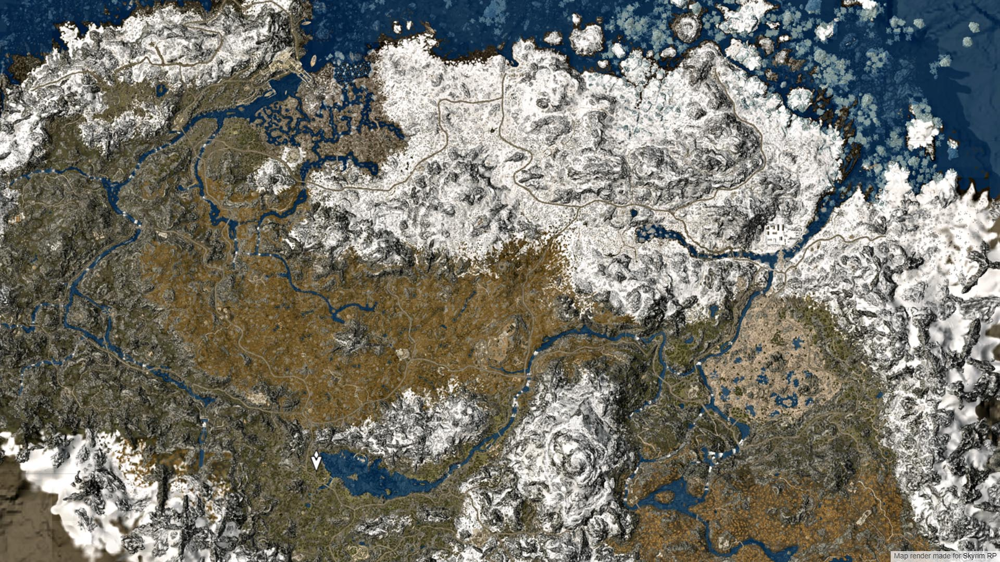

## Skyrim interactive map

### Scripts

Requires [Node.js](https://nodejs.org/) to run.

Install the dependencies and devDependencies and build.
* `npm run build` is used to build the project
* `npm run watch` is used to start watching

### Roadmap
If you have any suggestions, please write to us.
- [x] Map render with 4 zoom levels
- [x] Getting a list of markers from the server
- [x] Flexible customization of markers
- [x] Marker customization depending on the type
- [x] Configured webpack and add preprocessor support
- [ ] Sidebar with filters and search markers
- [ ] User's settings
- [ ] Admin tools
- [ ] Drawer

### License

MIT

For more information see `LICENSE` file.
